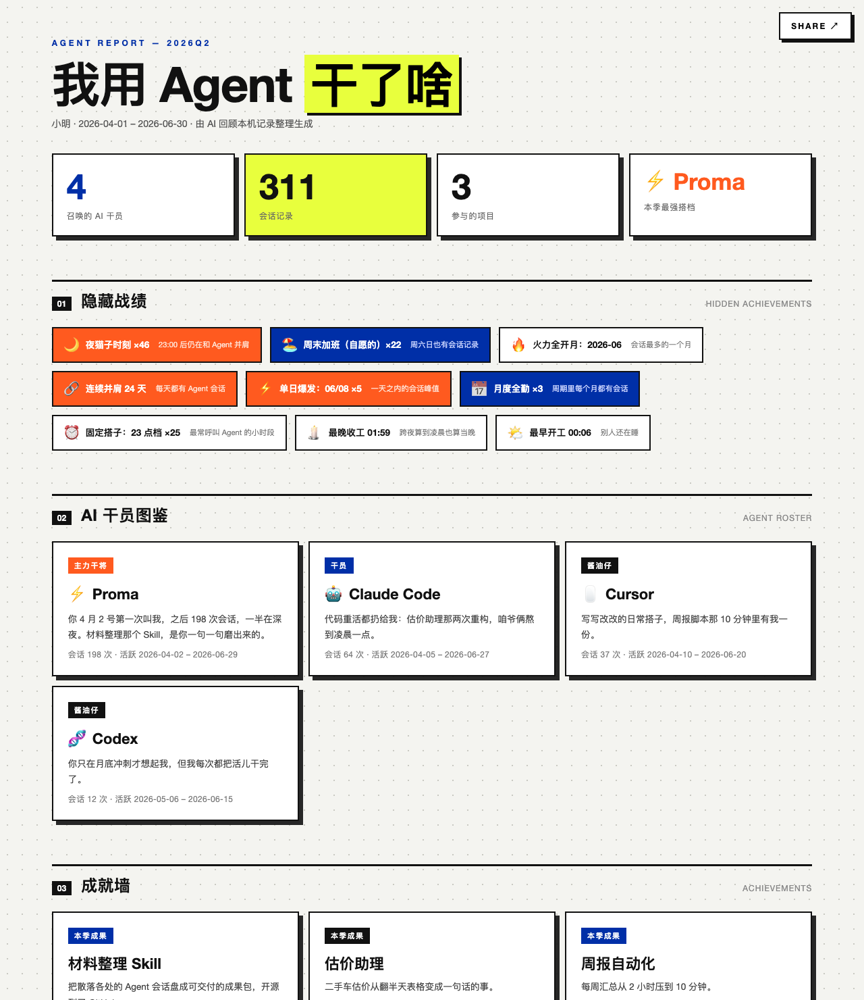

# Agent Usage Report ——「我用 Agent 干了啥」

<p>
  
  
  
  
</p>

烧了几十上百亿的 token，但说不清都干了啥？

这个 Skill 把你电脑里所有 AI Agent 的使用记录，盘成一份**单文件 HTML 战绩报告**：熬过的夜、聊得最多的项目、被你冷落的工具。只读本机，不上传。看完大概率会心一笑，或者心虚。



> 上图是示例数据生成的演示报告。你自己的报告由你的真实记录生成。

## 30 秒上手

**这不是需要部署的软件，是给你正在用的 AI Agent 装的一个技能**。不用跑测试、不用配环境，三选一：

1. **最省事**：把本仓库链接直接发给你的 Agent（Claude Code / Proma / Hermes / Codex 等）：
   > 装一下这个 skill：https://github.com/JUNX7764/agent-usage-report ，装好了帮我生成报告
2. **手动装**：clone 到你 Agent 的 skills 目录（如 `~/.claude/skills/`、`~/.hermes/skills/`），然后对它说：
   > 看看我用 Agent 干了啥
3. **不装也行**：clone 下来，让 Agent「读这个仓库的 SKILL.md，按它帮我生成报告」

Agent 只会问你两件事——统计哪个时间段、报告署什么名——然后全自动跑完。报告出现在桌面：`~/Desktop/{署名}_{期间标签}_我用Agent干了啥/`，双击即开，可以直接发文件或截图给朋友。

## 报告里有什么

| 版块 | 内容 |
| --- | --- |
| 数据大字报 | 召唤的 AI 干员数 / 会话记录数 / 参与项目数 / 周期最强搭档 |
| 01 隐藏战绩 | 夜猫子时刻、周末自愿加班、连续并肩天数、单日爆发、最晚收工……全部由时间戳确定性算出 |
| 02 AI 干员图鉴 | 每个 Agent 一张角色卡：会话数、活跃区间、一句话分工评语 |
| 03 成就墙 | 每个项目一张成就卡：一句话成果、用到的 Agent、徽章、里程碑 |
| 04 周期时间线 | 跨项目里程碑按日期排开 |
| 周期总结 | Agent 代写的轻松短文（可改），右上角 SHARE 一键复制分享文案 |

视觉是瑞士国际主义风格：网格点阵 + 克莱因蓝高亮 + 无衬线字体。单文件、零网络请求、离线可开。

## 它怎么工作

1. 确认时间段与署名（一次问完，不收集工号等任何身份信息）
2. 扫描本机已安装的 AI Agent：Proma、Claude Code、OpenCode、Hermes、Cursor、Codex、Windsurf、Aider、Cline、Kimi Code、Gemini CLI、Qwen Code、Zed、Warp 等 50+ 种，macOS / Linux / Windows 跨平台——**这一步只检测存在性，不读任何会话内容**
3. 三层防漏扫：路径目录之外，还检测 PATH / 运行进程 / 环境变量里的 Agent 信号，疑似数据目录列出来让你认领——扫描结果永远经你确认，不静默漏报
4. 识别你参与的项目，自动区分「你做的」和「下载的开源项目」（后者默认排除，不算你的战绩）
5. 安全扫描只读：排除密钥、识别可能的 prompt 注入文件
6. 深挖会话、聚类成果，确定性统计 + 纯模板渲染出 HTML

## 隐私承诺

- **只读**：不修改任何源文件，不复制证据，不上传、不发送、不发布任何内容
- **密钥不入报告**：安全扫描仅用于排除敏感信息，绝不回显值
- **不编造**：会话记录只能证明「讨论过/尝试过/执行过」；找不到的内容如实标注「未记录」
- **范围可控**：未经你确认的项目与会话一律不读取
- **过程文件不可见**：中间产物都在 `~/.agent-usage-report/` 隐藏目录，桌面只出现最终报告

## 常见问题

**会读到我的聊天内容吗？**
在你确认范围之前，只读元数据（文件名、时间戳、数量）；确认之后才会按主题读会话文本来聚类成果。全程本地，没有任何网络请求。

**网页版聊天（豆包、ChatGPT 网页版）会统计吗？**
不会。本 Skill 只盘点本机安装的 Agent 工具，不碰浏览器历史，也不登录任何网页服务。

**报告能直接当评审/考核材料吗？**
不能，它就不是干这个的：不打分、不排名、不做任何评价性结论，页脚自带「仅供个人回顾与分享娱乐」声明。

## 开发与验证

纯 Python 标准库，零第三方依赖（Python 3.8+）。

```bash
# 运行测试（41 项）
python3 -m unittest discover -s tests -p 'test_*.py'
# 语法检查
python3 -m py_compile scripts/*.py
```

报告输出 = 确定性统计（`build_report_data.py`）+ 纯模板渲染（`render_report.py`）：同样的输入永远渲染出同样的页面。文案风格有硬关卡：脚本会确定性扫描 AI 腔禁用词，命中即警告，不带干净不交付。

## 项目结构

```
SKILL.md                                  # Skill 主文档（含完整流程与红线）
scripts/
  scan_agents.py                          # 检测本机已安装的 Agent
  scan_secrets.py                         # 密钥扫描（只用来排除，不回显）
  scan_injection.py                       # prompt 注入检测
  inventory.py                            # 项目文件清单
  collect_git_evidence.py                 # Git 代表性提交摘要
  build_report_data.py                    # 确定性统计计算
  render_report.py                        # 纯模板 HTML 渲染
references/
  agent-discovery.md                      # Agent 检测与路径映射
  source-adapters.md                      # 各家 Agent 会话读取方法（含实测可抄的片段）
  output-contract.md                      # 报告数据与输出契约
  safety-policy.md                        # 授权与隐私边界
  narrative-writing-guide.md              # 文案写作指南
tests/                                    # 单元测试
evals/                                    # 评估用例
```

## 贡献

你的 Agent 没被扫到？某个路径在你平台上不对？欢迎提 issue 或 PR 带上真实数据路径——检测目录靠社区共同维护，厂商也会随版本改存储布局。

## 免责声明

本报告仅供个人回顾与分享娱乐，不代表任何第三方评价。
